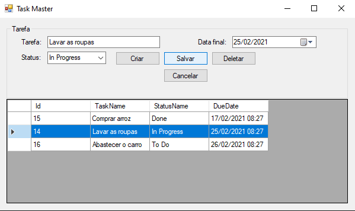

# O projeto

- Trata-se de um gerenciador de tarefas simples, usando o Entity para a persistência.
- Feito com base no tutorial de [Les Jackson | Step by Step - Entity Framework](https://www.youtube.com/playlist?list=PLpSmZmoBaROYOxp50yy_uewyMr5rOmx1f) no Youtube.

